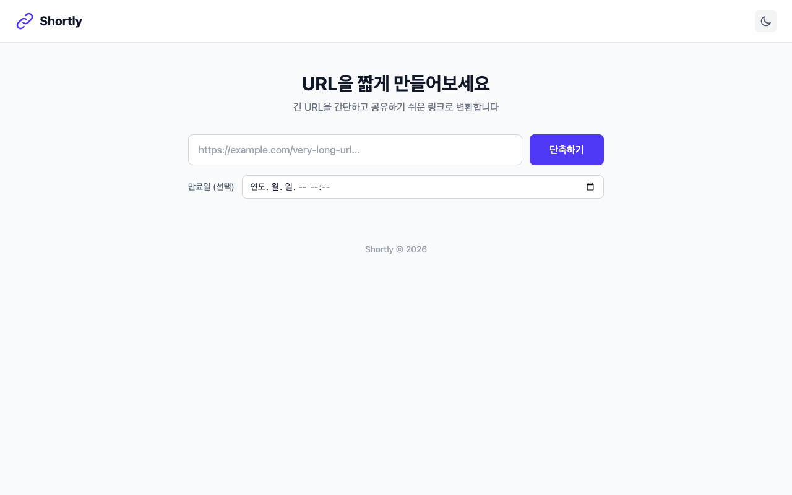
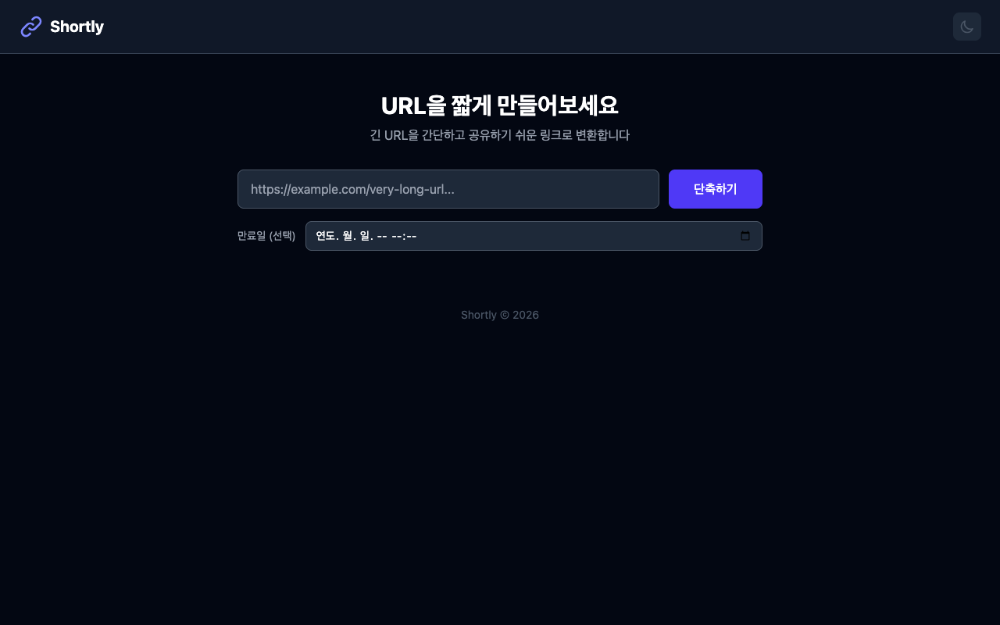
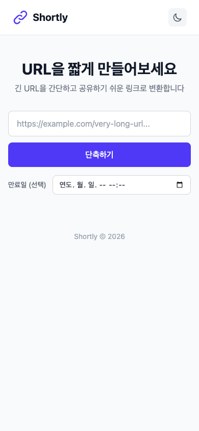

# Shortly Frontend

URL 단축 서비스 [Shortly](https://github.com/Shorten-it/Shortly)의 프론트엔드 애플리케이션입니다.

## UI Screenshots

### Light Mode


### Dark Mode


### Mobile
<p align="center">
  
  
</p>

## Tech Stack

- **React 19** + **TypeScript**
- **Vite 8** (빌드 도구)
- **Tailwind CSS v4** (스타일링)
- **Docker** + **Nginx** (배포)

## Features

- URL 단축 (만료일 설정 옵션)
- 단축 URL 클립보드 복사
- URL 히스토리 관리 (localStorage)
- 미리보기 / 삭제
- 다크모드 / 라이트모드 (시스템 설정 자동 감지)
- 반응형 디자인 (모바일 / 데스크톱)

## Getting Started

### Prerequisites

- Node.js 22+
- npm 10+

### Installation

```bash
git clone https://github.com/Shorten-it/frontend.git
cd frontend
npm install
```

### Development

```bash
cp .env.example .env
npm run dev
```

개발 서버가 `http://localhost:3000`에서 실행됩니다.
API 요청은 `/api` 경로로 프록시됩니다.

### Build

```bash
npm run build
npm run preview  # 빌드 결과 미리보기
```

### Docker

```bash
docker build -t shortly-frontend .
docker run -p 3000:80 shortly-frontend
```

빌드 시 API URL을 설정하려면:

```bash
docker build --build-arg VITE_API_BASE_URL=https://api.example.com -t shortly-frontend .
```

## API Endpoints

백엔드 API ([Shortly](https://github.com/Shorten-it/Shortly))와 연동합니다:

| Method | Endpoint | Description |
|--------|----------|-------------|
| POST | `/api/v1/url/shorten` | URL 단축 |
| GET | `/api/v1/url/{shortUrl}/preview` | 원본 URL 미리보기 |
| DELETE | `/api/v1/url/{shortUrl}` | 단축 URL 삭제 |
| GET | `/{shortUrl}` | 원본 URL로 리디렉션 (301) |

## Project Structure

```
src/
├── api/
│   ├── client.ts          # API 클라이언트
│   └── types.ts           # 타입 정의
├── components/
│   ├── Header.tsx         # 헤더 (로고 + 다크모드 토글)
│   ├── UrlShortener.tsx   # URL 단축 폼
│   └── UrlHistory.tsx     # 히스토리 목록
├── hooks/
│   ├── useTheme.ts        # 다크모드 훅
│   └── useUrlHistory.ts   # 히스토리 관리 훅
├── App.tsx                # 메인 앱
├── main.tsx               # 엔트리포인트
└── index.css              # Tailwind CSS
```

## License

MIT
